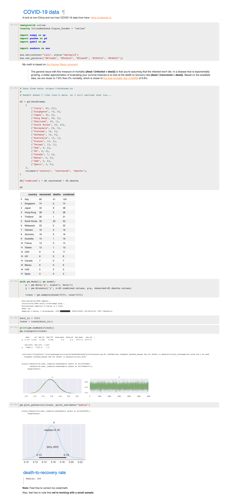

# COVID-19

My PyMC3 model based on [this Hacker News comment][hn]:

> __The general issue with this measure of mortality `(dead / (infected + dead))` is
> that you're assuming that the infected won't die.__ In a disease that is exponentially
> growing, a better approximation of evaluating your survival chances is to look at the
> death to recovery rate `(dead / (recovered + dead))`. Based on the available data,
> we are closer to 7.8% than 2% mortality, which is closer to [the final mortality rate of SARS][wiki]
> of 9.6%.

This model suggests we could be closer to a __13+% death-to-recovery rate__ based on
[the available small datasets][outbreak].

__Note__: data from China and Iran were not used.

[hn]: https://news.ycombinator.com/item?id=22433359

[wiki]: https://en.wikipedia.org/wiki/Severe_acute_respiratory_syndrome

[outbreak]: https://outbreak.cc

